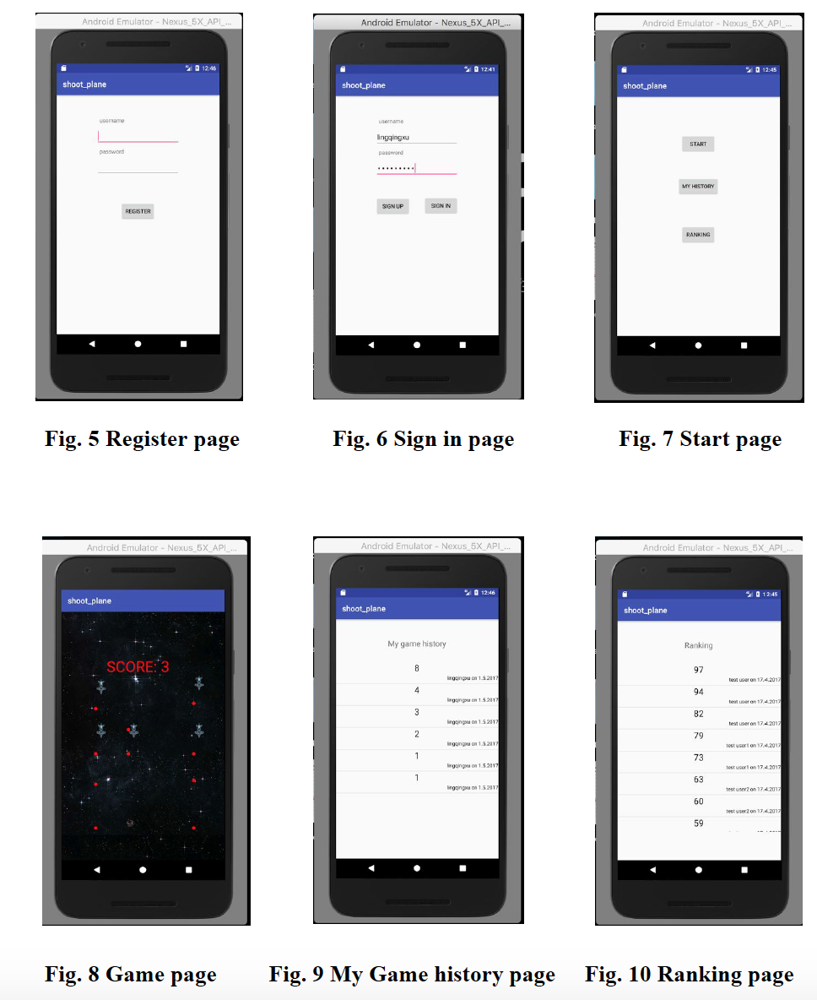
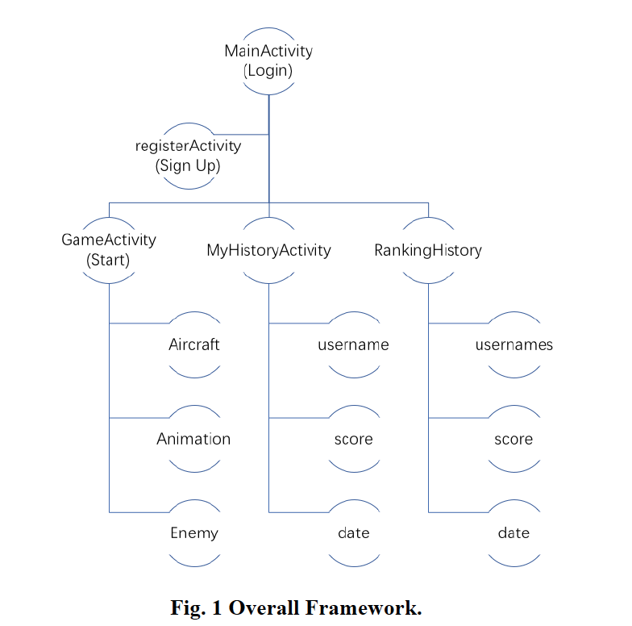
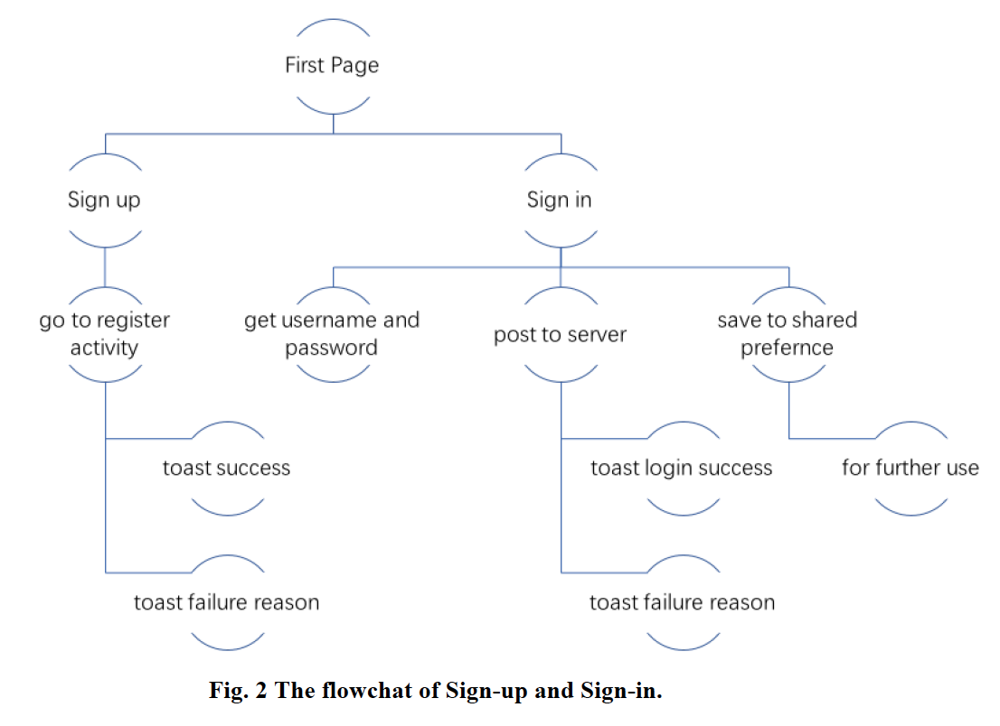
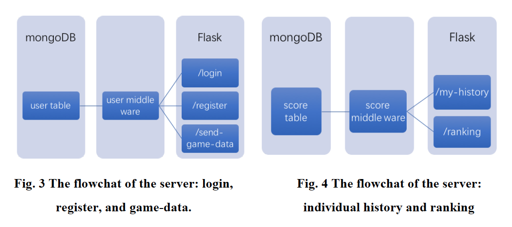

# Space-Shooting

## A Brief Description
Space shooting games are a kind of action games, which test the player's speed and reaction time. The purpose of a shooter game is to shoot opponents and proceed through missions without the player’s character being killed or dying.

We implement an architecture consists of a server and multiple users, and allow users to compete in the space shooting game. More specifically, we implement a console game of space shooting and it scores the user’s performance, and the server is in charge of user management and overall ranking. Under this architecture, users can compete with others.

We implement a shooter game on the Android platform, and allow users to compete with each other. Furthermore, this server-based multiple user structure also support collaborative gaming. 

## Development and Test Environment
Our development environment is as follows:
- build:gradle:2.3.0
- buildToolsVersion "25.0.2"
- support:appcompat-v7:25.3.1
Test environmentis as follows:
Real Phone: Huawei Honor 5X; System: EMUI 4.0; Android version: 6.0.1 Android Virtual Device (AVD): Nexus S Android 6.0 API 23 Platform 

## Architecture
Our system consists of five major modules: Login (MainActivity), Sign Up (register Activity), Start (GameActivity), MyHistoryActivity, and Ranking History.
- For the GameActivity, it includes four attributes, namely, Aircraft, Animation, bullet,  and Enemy. 
- For the MyHistoryActivity, it includes three attributes, namely, username, score, and date.
- For the RankingHistory, it includes three attributes, namely, usernames, score, and date. 

### flowchat-user

### flowchat-server

## Detailed Description
### Subseciton A. Space Shooting Game
1. Design Overview
We use the procedural way to design our App, which means writing Java code to create and manipulate all the user interface objects. The reason we chose this way is that the View is changing all the time, which is easier to manipulate using code that xml files. The View is realized by Class GameView using canvas, which draw 40 times per second to make to picture look like animation.

The logic of the game is: After the game begins, user’s aircraft continues shooting towards enemies, and enemies shoot towards user’s aircraft every 3 seconds. The enemies will explore if colliding with user’s bullet. Similarly, if user’s aircraft collides with any enemy or enemy’s bullet, the game is over. Then the score will be shown on the screen to indicate how many enemies has the user eliminated.

2. Classes Overview
(1) Class Bullet: 
This class includes the attributes and methods a bullet has. In the game both the enemies and out aircraft can shoot, but their bullets features are different, which is described in their own Bullet Class.
The Bullet Class mainly records the coordinate and moving step of the bullet, and its animation when moving forward. If the bullet  collides with an enemy or is out of boundary of screen, it should not be seen any more, so we use a boolean variable “isVisible” to record its state. Every time before the canvas refresh the animation, the coordinate is updated using the method UpdateBullet(). The DrawBullet() method is responsible for drawing the bullet in the right position after updating.

(2) Class Animation
As the name indicates, the Class Animation controls the animation of bullet, user’s  aircraft, and enemies. It not only records how many frames an animation has and their responding bitmaps, but also the animation play states, such as interval, play time, loop, finish state. The method DrawAnimation (Canvas canvas, Paint paint, int x, int y) realizes draw the animation in order.

(3) Class Aircraft and Class Enemy
The class Aircraft and Class Enemy are similar, representing the behavior of the user and enemy respectively. The attributes of the classes include the coordinate of the aircraft/enemy, character of shooting (shooting interval, bullet number, bullet offset, bullet array) and their living state (isAlive or not). They have three methods: init() to initialize the position and state; UpdateAircraft (int touchPosX, int touchPosY) to change the position of aircraft when touching; DrawAircraft (Canvas canvas, Paint paint) to draw it on the canvas.

(4) GameActivity
The GameActiviy controls all the operations and states in the game. As mentioned above, we use the procedural way to design our App, so we create an inner class GameView to be responsible for the UI. The GameView class starts a new thread to refresh the animation every 25 ms. After initializing, it first check the state flag “isThreadRunning”. If the thread is running, it updates all the instances’ state before drawing them on the canvas. If user’s aircraft is dead, the thread will stop, and draws the score on the screen.

3. Detail Realization
(1) Background Scroll
The background picture has been scrolling back to the player, making an illusion of their own control of the aircraft in the forward flight. In our game, two map images in the screen behind the alternate rolling, this will give players a forward move illusion.

(2) Animation Refresh
The animation refresh is realized in a standalone thread, which sleep 25 ms in every loop. In every loop, the state(alive/ dead), position(coordinate), corresponding bitmaps are prepared and updated, then they are drawn on the canvas.

(3) Aircraft Moving
After touching the screen at any point, the program can get the current point of the X, Y coordinates. Calculate the distance between the current X, Y coordinate points and the target X, Y points centered on the X Y coordinates of the current aircraft. Because the aircraft can not directly fly to the target point from the current coordinates, so we add the current coordinates of X, Y  to one step every loop. Here we need to consider when the aircraft is moving but the user stops to touch the screen. if you stop touching the plane will stop in place rather than move to the target point until the player touches the new screen X, Y coordinates.

(4) Collision
As the number of bullets is quite a lot, each bullet needs to use an object to record the current bullet X, Y coordinates and drawing in the screen area, each plane is also an object recording its X, Y coordinates with the drawing area in the screen. In this way, dealing with the collision is actually the collision of a rectangular area of each bullet with each enemy's rectangular area. By traversing the bullet object and the enemy object we can calculate the result of the collision, and change the state of the aircraft.

(5) Memory Leaks Preventing
If in accordance with the above idea directly, we will  create bullet objects and enemy objects frequently, which will cause serious problems such as memory leaks. As the number of bullets that need to be drawn on the screen and the number of enemy planes is certainly limited, we can initialize the fixed bullet object and the enemy object only to update these objects and their logic. For example, in the current game screen I need 5 aircraft, the code I will only allocate five enemy objects, respectively, to detect if the bullet hit these objects or the bitmap goes down the bottom of the screen. If so, we can reset the property, so that the aircraft reappeared in the top of the battlefield. In this way, the player will feel endless enemies, but we don’t have to create new objects every time.

(6) Game Music
To make the game more enjoyable, we add background music and special effects music. The special effect music is triggered when an enemy is eleminated.

### Subseciton B.  Sever’s Functions: Detailed Description
The server is hosted on AWS EC2. It communicates with app by http request and response, which follows the REST api convention.  

It contains five interfaces: login, register, send game score, get recent game record and global ranking. App post or get to corresponding path to send or retrieve data. Data will be saved to User collection and Game collection in MongoDB.

The http request is first handled by Flask, a python microframework. If app post some data, flask will resolve the data and warp it to python dict for future use. Then the middleware will try to save that data to corresponding data table in MongoDB. The success operation or error reason will be packeted to JSON format and then send back to app by flask.

If the app want to look up some resources, for example, the recent game history. The middleware will search the desired resources in mongoDB and then return them in JSON format to the app.

For stability of server, the unit test cases is created for the server by Python unittest package. Every deployment after modification the code of server will first run test cases to ensure every function is well behaviored.

### Subseciton C: Sign In (LogIn), Sign Up (Registration)
Name and Password: R.id.username, R.id.password, Http Post
In registration, If the username has been registered before, the server will return a hint: duplicate username. If successfully sign up the game, there will be a toast says: go back to sign in. In login activity, if what the user entered do not match the data of  database table in server, it will return a sign in failure because of wrong username and password. If successfully sign in the game, there will be a toast says: Enjoy the adventure in the activity that displays the start button to play the game, the My History button to check the history of scores of this user, and the Ranking button to check the rank of this specific user in all users who have played this game by the app we developed before.

### Subseciton D. Individual History
For an individual user, the history information includes two types: recent activity, and history statistics. 

A. Recent Activity

At its most basic it can be used to time and record the scores for any single game. The attributes includes the reaction speed, the fly distance, the number of obstacles. For the moments, the score for each game is by simply weighted sum of those attributes.

B. History Statistics

The aim is to record scores and stats for each individual game. It can also be used to record user-defined stats for every player with the option of outputting the data to a file.
This module visually shows a statistic histogram to the player, and excite him to player another new game so that he can update his scores.

### Subseciton E. System History
For the whole system, the history information also includes two types: recent activity, and history statistics. 
            
A. Recent Activity

	We record the most recent several shooting game’s in a list style. This information give a direct implication of the system’s current states. Usually, active players check this information a lot during his play.

B. History Statistics

This is a statistics made from all activities happen in the system from its launch.  Most importantly, we provide an overall ranking for both all users and all games.

